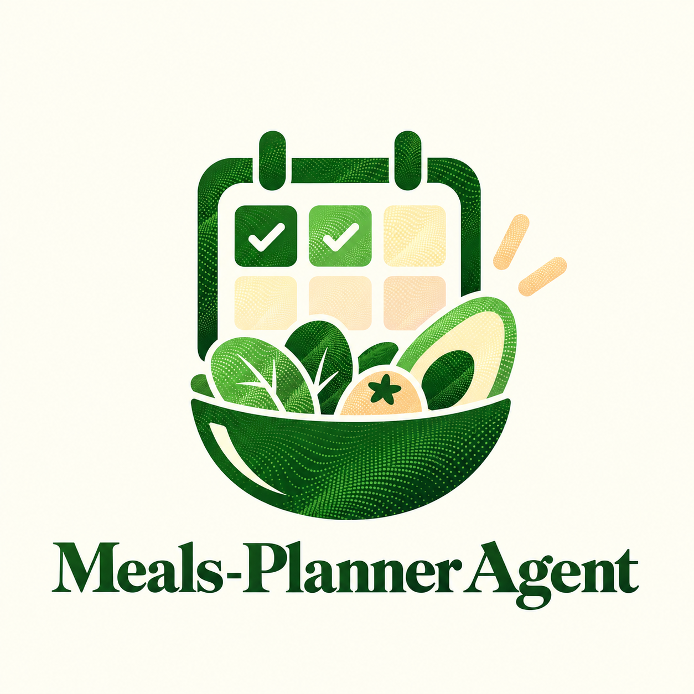

# Meals Planner

<p align="center">
  
</p>

A Hermes agent for Plow. Text it what you need and it plans the week's meals,
tracks calories against your target, keeps the cost inside your budget, and
prices the shopping at a real shop near you.

- **Plan** a week of meals with calories and cost per day, around what you cannot
  eat and the brands you buy.
- **Shop** from one list, grouped the way a shop is walked, priced at your store,
  with where it is, how far, and when it shuts.
- **Look up** what any food costs, with its photo and what a portion holds.
- **Track** what you actually ate and see what's left for the day.

The skill's own store lives in the installation's Hermes home. Store and price
lookups send Kroger an ingredient name or a postcode, never who is asking. The
agent holds no payment method, opens no delivery account, and does not order or
buy anything.

## What you can ask it

Every row was run through the agent's own tools against real Ralphs Downtown San
Diego data (postcode 92101) on 16 September 2026; the figures are what came back.

| Use case | Text it | What it does |
|---|---|---|
| **A week that fits your diet** | "Plan my week: vegan, 1,800 calories a day, $60 budget" | Saves vegan, then plans 21 meals from 12 vegan recipes at 1,780 to 1,950 kcal a day, $50.80 against the $60 |
| **Gluten or lactose at home** | "Plan the week gluten-free and no lactose for 3 people" | Plans gluten-free and dairy-free for the whole household, every recipe tagged both, and reminds anyone with coeliac disease to check labels |
| **Your numbers, worked out** | "I'm 30, male, 5'10", 175 lb, moderately active, I want to lose fat" | 2,182 kcal with 175 g protein, 233 g carbs, 61 g fat, 31 g fibre and 88 oz water, computed by the script, and never below a safe floor |
| **A shopping list you can walk** | "Send me the shopping list" | Groups the list by section, prices 38 of 40 lines at your store, picks packs that fit the week, and says where the shop is and when it shuts |
| **Your brands** | "I always buy Chobani yogurt and Jif peanut butter" | Prices those brands even when dearer, and says when a shop does not carry one |
| **What does this cost here?** | "How much is milk near 92101?" | Looks the shelf up live: Ralphs Vitamin D Whole Milk, $4.79 a gallon. Never a price from memory |
| **What's in this food?** | "Show me the avocado" | Sends the photo, then a 140 g portion: 288 kcal, 28.4 g fat, 11% of the day, and says fibre is not published |
| **Staying on track** | "I had a 700 calorie burrito for lunch, what's left today?" | Logs it and answers from the record: 1,300 left of 2,000 |

It also says what it does not know:

- **No local shop, no pretending.** From a Brazilian number it hides US shelf
  prices and asks whether you want them anyway; where no Kroger shop is near, the
  list says every figure is an estimate.
- **The price you saw counts.** "Bananas were $0.22 each at Trader Joe's" is
  saved for 14 days and labelled on the line as your price, not the store's.

## Install

Docker Desktop and a free Plow line are the only prerequisites.

1. Get a line for this agent and mint its credential with Plow's own CLI, then
   save the result as `plow-credentials` in this folder, mode 0600. It stays out
   of Git and out of the image.
2. Build and start it:

```sh
docker compose up --build -d
docker compose logs -f agent
```

3. Text the line. Tell it how many people eat and your daily calorie target, then
   ask for the week's plan.

`docker compose down` stops the agent and keeps its records. `docker compose
down -v` deletes them permanently, along with the installation's reporting
identity.

The container reports token usage to the Agent Index every five minutes. An agent
whose owner does not want that is one built without the `image/s6-overlay`
service.

## Restrictions and brands

Before the first plan the agent asks three things: anything you cannot eat, such
as gluten or lactose; whether you are vegan or vegetarian; and whether you always
buy a particular brand. This is a gate, not a suggestion: `plan` refuses until
the answer is saved, and "none" is an answer.

- **Restrictions** are `vegetarian`, `vegan`, `gluten-free` and `dairy-free`.
  Everyday words map onto them, so lactose plans dairy-free. Anything else, such
  as a nut allergy, is refused rather than saved and ignored.
- **The shipped recipes** are tagged vegan and dairy-free from their ingredients,
  and a test holds those tags to the ingredient lists.
- **Changing a restriction** rebuilds a saved week instead of replaying one you
  can no longer eat.
- **Brands** are per ingredient (`brand set --item yoghurt --brand Chobani`). The
  shopping list prices your brand when the store stocks it, even when dearer,
  and says so when it does not.

## Real stores and real prices

`refresh.py` builds the snapshots the skill reads. It runs out of band — at build
time or on demand — never inside a chat turn, so replies stay fast, offline and
deterministic.

```sh
# Supermarkets within 5 km of a point, from OpenStreetMap
python3 refresh.py stores --lat 34.0522 --lon -118.2437 --radius-km 5

# This store's prices for every catalogue ingredient, from Kroger
python3 refresh.py prices --zip 90017
```

Stores land in `skills/meals/stores.json` and ship with the agent: names,
brands, street addresses, opening hours and coordinates. Ask the agent for
`stores` and it lists the nearest ones with distances.

Prices need a free app at developer.kroger.com, then `KROGER_CLIENT_ID` and
`KROGER_CLIENT_SECRET` in `.env`. They land in `skills/meals/prices.<locationId>.json`,
which Git ignores — Kroger's developer terms cover calling their API for your own
planning, not republishing their prices. Tell the agent which store to use with
`profile set --store <locationId>`.

Each shopping-list line then says where its figure came from:
`kroger:70100123 2026-09-16` for a real price, or `catalogue estimate` when the
package size can't be converted to the recipe's unit — a 32 oz bag has a per-kilo
price, "family pack" does not, and the agent admits the difference instead of
inventing one.

The product on a line is the one that costs least to buy for what the week
needs, not the cheapest per kilo. 380 g of chicken used to pick an 8 lb frozen
bag at $20.00, the best rate on the shelf; it now picks a 1 lb pack from the
counter at $2.50. On one real Ralphs week that took the shop from $162.35 to
$106.28. Each line says how many `packages` that is. Product names that say they
are more than the ingredient (overnight oats, a couscous mix, deli turkey) are not
counted as it; rebuild older snapshots with `refresh.py prices` to apply that.

### What "best value" means

A priced line carries `unit_price`, `median_unit_price` and a `value` label
comparing the two: `best value` at 70% of the median or below, `good value` to
92%, `typical` above that, and `only priced option` when there was nothing to
compare with. On a real basket that spread came out as 13 best, 11 good, 6
typical across 33 lines.

It is a price comparison at one store on one day. It says nothing about quality,
nutrition or whether the food is worth buying, and both numbers are on the line
so the claim can be checked. Sale prices count: Kroger cage-free eggs at $4.39
with a $2.79 promo are compared at $0.155 each, not $0.24.

### Prices you confirm yourself

Some prices no API will sell you. Ralphs weighs bananas, the recipe counts them,
and no free API publishes a per-piece produce price — so the only honest source
is a person who looked.

```sh
# in a conversation with the agent, or directly:
meals.py --scope <chat> override set --item banana --price 0.22 --unit un \
  --source "Trader Joe's (web, 16 Sep)"
```

That line then reads `you confirmed 2026-09-16 (Trader Joe's (web, 16 Sep))`
instead of `catalogue estimate`, and counts in the total. Three rules keep it
honest:

- **It expires.** Fourteen days by default, `MEALS_OVERRIDE_DAYS` to change it.
  A stale one is refused, listed in `stale_overrides`, and the line falls back to
  the estimate rather than quietly reusing an old number.
- **The unit must match the recipe's.** A per-kilo price cannot pay for a recipe
  that counts bananas; it is reported in `mismatched_overrides`, never converted.
- **A web price is not a price.** The agent may look one up and say it, marked as
  not from the catalogue, but it never enters a plan or a total until you confirm
  it as an override. Every number in a total can name its origin: a store's API,
  a price you confirmed, or the catalogue.

## Ordering is not in this version

The agent plans, prices and makes the list; it does not order or buy. Asked to,
it says so and offers the list and where to collect it. Two ways of buying are
built and tested in this repository but left out of the image:

- **A Kroger cart** (`skills/meals/scripts/cart.py`, `tests/test_cart.py`) adds
  the priced products to the person's own Kroger or Ralphs cart after a Kroger
  login, and they check out in the app. It ships once a shopper login has been
  tried end to end. The login lands on `pages/kroger/`, published from the
  `gh-pages` branch; the Kroger app needs the Cart API and that page as its
  redirect URI.
- **An Instacart link** (`skills/meals/scripts/instacart.py`,
  `tests/test_instacart.py`). Instacart's developer programme is not taking
  applications (September 2026) and is open only to the US and Canada.

Restaurant orders from the catalogue's venues stay behind `MEALS_ORDERING=on`:
the shipped venues are samples around one city, not a real directory.

## Targets and macros

Give the agent your stats and it works out the day's numbers — in code, not in a
model's head:

```sh
meals.py --scope <chat> profile set --age 30 --sex male --height-in 70 \
  --weight-lb 175 --activity moderate --goal maintenance
meals.py --scope <chat> targets
```

Mifflin-St Jeor for BMR, an activity multiplier for TDEE, a goal adjustment, then
macro grams: protein by bodyweight, fat at 25% of intake, carbohydrate the
remainder, fibre at 14 g per 1,000 kcal with a 25 g floor. A target that would
fall below **1,200 kcal for a woman or 1,500 for a man is held there**, flagged
as `floored`, and the note says that going lower needs medical supervision. That
floor is enforced in the script, not requested in a prompt.

Plans then report what they actually contain:

```sh
python3 refresh.py nutrition          # macros for every catalogue ingredient
```

That snapshot comes from USDA FoodData Central (public domain), keyed by the
catalogue's own ingredient names. Each plan day carries `protein_g`, `carb_g`,
`fat_g` and `fiber_g`, plus `macros_unknown` naming anything that could not
contribute — and `macros_complete` is false whenever that list is non-empty.

Two rules worth knowing:

- **Cost scales with household size; macros do not.** Quantities multiply by
  `people` for the shopping list, but calories and macros are what one person eats.
- **A counted ingredient needs USDA's published portion weight.** A banana is
  126 g as an NLEA serving, which is a citable figure; without one, the
  ingredient is named unknown rather than converted by a number I made up.

A free key from [fdc.nal.usda.gov](https://fdc.nal.usda.gov/api-key-signup.html)
goes in `.env` as `USDA_API_KEY`. `DEMO_KEY` allows roughly thirty calls an hour
and a full catalogue needs seventy-six, so a rate-limited run keeps every lookup
that succeeded and names the rest in `pending`. There is no resume: a re-run
starts from the top.

**This is not medical advice.** The agent holds no certification, says so, and
points at a physician for a pre-existing condition, pregnancy, or a history of
disordered eating.

## Layout

| Path | What it is |
| --- | --- |
| `skills/meals/` | The skill Hermes loads: its rules, the task script, the catalogue |
| `runtime/persona.md` | Who the agent is in conversation |
| `index.py` | The pinned Agent Index client, for publishing and reporting |
| `tests/` | Script tests, run without a model |
| `image/` | Supervised services for the container build |
| `pages/kroger/` | The Kroger login page for the cart, not shipped yet |

## Tests

```sh
python3 -m unittest discover -s tests -v
```

## Publish

The running container registers itself and reports usage every five minutes. That
first registration carries only the agent id, so the page starts bare; this fills
it in, including the demonstration video and screenshots.

The Hermes home lives inside the container's volume, so registration runs there,
not on the host. `with-contenv` is an execline script that a plain `exec` cannot
run, so read the token from the container environment directly:

```sh
docker compose exec -T agent /bin/sh -c '
TOKEN=$(cat /run/s6/container_environment/PLOW_AGENT_TOKEN)
exec /command/s6-setuidgid hermes env HOME=/var/lib/hermes HERMES_HOME=/var/lib/hermes \
  AGENT_ID=meals-planner PLOW_AGENT_TOKEN="$TOKEN" \
  /opt/hermes/.venv/bin/python3 /opt/plow/agent-index-client.py \
  --register --agent meals-planner --name "Meals Planner" \
  --blurb "..." --repo https://github.com/lusknchars/meals-planner --runtime Hermes \
  --install-url https://github.com/lusknchars/meals-planner/blob/main/README.md \
  --video <YouTube video id> --image https://example.com/your-screenshot.png
'
```

`--video` takes the id, not a link: for `youtube.com/shorts/6HgmhqNmGfU` it is
`6HgmhqNmGfU`, because the page embeds the player by id. `--image` repeats, one
public image URL each.

An `--install-url` with a `#fragment` is rejected: the client reports
`some values were not stored: {'install_url': 1}` and keeps the rest.

Swap `--register …` for `--dry-run` to see the usage that would be reported, or
`status` to check whether this installation is registered.

`index.py` wraps the same pinned client for a Hermes home on the host, which is
the path to use when you run Hermes outside Docker.
